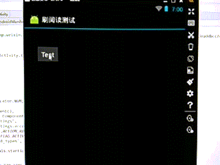

# 微信获取阅读数、点赞数、刷阅读量 方案

## 获取阅读数、点赞数
- **原理：** 使用 [**launchAnyWhere**](http://blogs.360.cn/360mobile/2014/08/19/launchanywhere-google-bug-7699048/) Exploit 来实现在虚拟机打开微信的内置 WebView。

- **步骤：**
  - 使用 [**wx_sniffer**](https://github.com/nekocode/wx_sniffer) 在本机监听网络，捕获 uin，key 或者直接捕获阅读点赞数。
  - 编写 Android APP，利用 **launchAnyWhere** 漏洞打开微信内置浏览器。

- **细节：**
  - **微信内置浏览器 Activity 路径：** com.tencent.mm.plugin.webview.ui.tools.WebViewUI
  - **Intent 参数：** rawUrl（传入网址）、title（可选，浏览器显示标题）、data（可选，执行 HTML 代码）

## 测试环境
- 本人使用 **逍遥安卓** 虚拟机（memu），配合 [adb_connect_memu](https://github.com/nekocode/adb_connect_memu) 进行代码测试。
- Android 版本号为 `4.2.2`

## 测试

## 刷阅读量
- 结合 **微信多开**，编写 Android APP 利用 **launchAnyWhere** 漏洞循环打开某篇文章（注意调度）。

